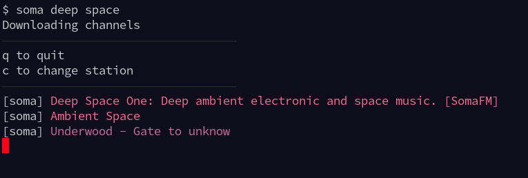
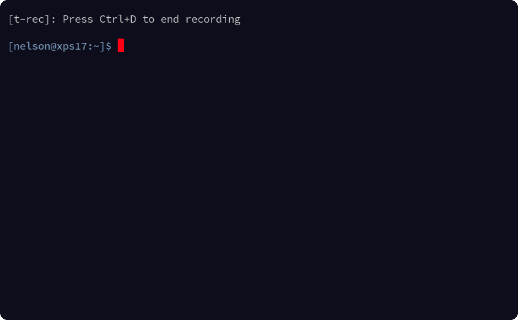

# soma <sub><sup><sub><sup>| Listen to [SomaFM](https://somafm.com/) in your terminal</sup></sub></sup></sub>
> **soma** is a fork of [somafm-cli](https://github.com/rockymadden/somafm-cli)

### simple, fast channel fuzzy search with style



### in action



### quick start
#### run `soma` without options to list all channels
type to search and/or select with arrow keys

## Use
### Listen to Groove Salad:
```console
$ soma groovesalad
22:27:30 | Mindex - Jagga-jah
```

#### run `soma <some search>` to filter
if a single station matches it will be started automatically
type to search and/or select with arrow keys


## build
### source using `nix`
```console
$ git clone git@github.com:NelsonJeppesen/somafm-cli-ng.git
$ cd somafm-cli-ng
```

## Use
```console
$ soma--help
soma v0.4.0

Usage:
  soma [options] [fuzzy filter]

  e.g. soma --quality=highest deep space

Fuzzy Filter
  Optional: if not given, a menu will be presented

  Enter term or terms to match one or more stations

  For example, the fuzzy filter chill nicely would match the channels
  Groove Salad and Groove Salad Classic because each term is in the
  station title of each channel

  If a fuzzy filter matches a single station, that station will started
  If a fuzzy filter matches more than one station, a menu will be presented

Options:
  --quality=QUALITY, -q QUALITY   default: high [low|high|highest]
  -c, --no-color                  disable color
  -v, --version                   print version
  -d, --debug                     enable debug mode
```

### Listen to Groove Salad:
```console
$ somafm listen groovesalad
22:27:30 | Mindex - Jagga-jah
```

### Listen to Groove Salad at highest quality:
```console
$ somafm listen groovesalad --quality=highest
22:27:30 | Mindex - Jagga-jah
```

## License
```
MIT License

Copyright (c) 2022 Nelson Jeppesen (https://jeppesen.io)

Permission is hereby granted, free of charge, to any person obtaining a copy
of this software and associated documentation files (the "Software"), to deal
in the Software without restriction, including without limitation the rights
to use, copy, modify, merge, publish, distribute, sublicense, and/or sell
copies of the Software, and to permit persons to whom the Software is
furnished to do so, subject to the following conditions:

The above copyright notice and this permission notice shall be included in all
copies or substantial portions of the Software.

THE SOFTWARE IS PROVIDED "AS IS", WITHOUT WARRANTY OF ANY KIND, EXPRESS OR
IMPLIED, INCLUDING BUT NOT LIMITED TO THE WARRANTIES OF MERCHANTABILITY,
FITNESS FOR A PARTICULAR PURPOSE AND NONINFRINGEMENT. IN NO EVENT SHALL THE
AUTHORS OR COPYRIGHT HOLDERS BE LIABLE FOR ANY CLAIM, DAMAGES OR OTHER
LIABILITY, WHETHER IN AN ACTION OF CONTRACT, TORT OR OTHERWISE, ARISING FROM,
OUT OF OR IN CONNECTION WITH THE SOFTWARE OR THE USE OR OTHER DEALINGS IN THE
SOFTWARE.
```
